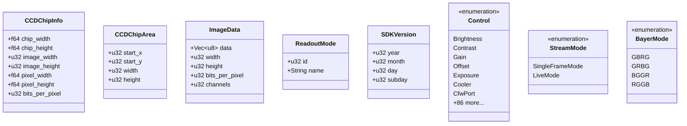

# qhyccd-rs Design Documentation

## Overview

`qhyccd-rs` is a comprehensive Rust library that provides safe, idiomatic bindings to the QHYCCD SDK for controlling QHYCCD astronomical cameras, filter wheels, and focusers. The library wraps the C-based QHYCCD SDK with a type-safe interface and includes a powerful simulation mode for development and testing without physical hardware.

## Project Structure


### Crates

1. **qhyccd-rs** (main crate)
   - Safe, high-level Rust API
   - Error handling with `eyre` and `thiserror`
   - Logging with `tracing`
   - Optional simulation feature

2. **libqhyccd-sys** (FFI bindings)
   - Low-level C FFI bindings
   - Direct mapping to QHYCCD SDK functions
   - Minimal dependencies

## Architecture

### High-Level Architecture


### Core Components

#### 1. Sdk - Entry Point and Resource Manager

The `Sdk` struct is the entry point for the library. It manages SDK initialization, device discovery, and resource cleanup.


**Responsibilities:**
- Initialize/release QHYCCD SDK resources
- Scan and enumerate connected devices
- Create Camera and FilterWheel instances
- Provide SDK version information
- Manage simulation mode

**Lifecycle:**


**Implementation Details:**

The `Sdk::new()` behavior changes based on the `simulation` feature flag:

- **Without simulation feature**: Calls `InitQHYCCDResource()`, scans for real hardware via `ScanQHYCCD()`, and enumerates connected devices.
- **With simulation feature**: Automatically creates a default simulated QHY178M camera with a 7-position filter wheel and cooler support.

The `Drop` implementation ensures `ReleaseQHYCCDResource()` is called when the SDK is destroyed, preventing resource leaks.

#### 2. Camera - Device Control

The `Camera` struct represents a single camera device and provides all control functionality.


**Backend Pattern:**

The camera uses an enum-based backend pattern to support both real hardware and simulation:

```rust
enum CameraBackend {
    Real {
        handle: Arc<RwLock<Option<QHYCCDHandle>>>,
    },
    #[cfg(feature = "simulation")]
    Simulated {
        state: Arc<RwLock<SimulatedCameraState>>,
    },
}
```

Every public method on `Camera` matches on the backend and dispatches to either FFI calls or simulated state updates. This provides a transparent interface where the same code works for both real and simulated cameras.

**Camera Operations:**


**Camera State Machine:**


**Key Methods:**

The `Camera` struct provides methods for:
- Device lifecycle: `open()`, `close()`, `init()`, `is_open()`
- Configuration: `set_stream_mode()`, `set_roi()`, `set_bin_mode()`, `set_bit_mode()`, `set_debayer()`
- Parameter control: `is_control_available()`, `set_parameter()`, `get_parameter()`, `get_parameter_min_max_step()`
- Information: `get_chip_info()`, `get_effective_area()`, `get_overscan_area()`, `get_firmware_version()`, `get_model()`, `get_type()`
- Imaging: `start_single_frame_exposure()`, `get_single_frame()`, `begin_live()`, `get_live_frame()`, `stop_live()`, `get_exposure_remaining()`, `stop_exposure()`, `abort_exposure_and_readout()`
- Readout modes: `get_number_of_readout_modes()`, `get_readout_mode_name()`, `get_readout_mode_resolution()`, `set_readout_mode()`, `get_readout_mode()`
- Filter wheel: `is_cfw_plugged_in()`

#### 3. FilterWheel - Filter Control

The `FilterWheel` wraps a `Camera` instance to provide filter wheel control functionality. This design reflects the hardware reality: QHYCCD filter wheels are directly connected to cameras and controlled through the camera interface.


**Implementation:**

The `FilterWheel` struct contains a single `Camera` field and delegates all operations to it. Filter wheel operations are implemented using the camera parameter API:
- `CfwSlotsNum` control: Returns the number of filter positions
- `CfwPort` control: Gets/sets the current filter position (0-indexed)

### Type System

#### Core Data Structures



**CCDChipInfo:**
Describes the physical sensor characteristics. Returned by `get_chip_info()`. Contains dimensions in millimeters, pixel counts, pixel sizes in micrometers, and maximum bit depth.

**CCDChipArea:**
Defines rectangular regions on the sensor. Used for:
- ROI (Region of Interest) via `set_roi()`
- Effective imaging area via `get_effective_area()`
- Overscan area via `get_overscan_area()`

**ImageData:**
Contains captured image data along with metadata. The `data` field is a flat `Vec<u8>` containing raw pixel data. The structure depends on `bits_per_pixel` (8 or 16) and `channels` (1 for mono, 3 for debayered color).

**Control:**
Enum with 86+ variants representing camera parameters. Each variant corresponds to a control ID in the QHYCCD SDK. Controls are organized into categories:
- Basic imaging: Gain, Offset, Exposure, Brightness, Contrast
- Color: Wbr, Wbb, Wbg (white balance)
- Temperature: Cooler, CurTemp, CurPWM, ManualPWM
- Binning modes: CamBin1x1mode through CamBin8x8mode
- Capabilities: Various Cam* controls indicating feature support
- Filter wheel: CfwPort, CfwSlotsNum
- Advanced: UsbTraffic, Speed, TransferBit, DDR, GPS, Humidity, Pressure, etc.

**StreamMode:**
Two imaging modes:
- `SingleFrameMode` (0): Long exposure mode for single frames
- `LiveMode` (1): Continuous video streaming

**BayerMode:**
Color filter array patterns for color cameras. Implements `TryFrom<u32>` for conversion from SDK values.

#### Error Handling


**Error Design:**

The `QHYError` enum uses `thiserror` to derive the `Error` trait. Each variant includes an `error_code` field when applicable. The library uses `eyre::Result<T>` as the return type for all fallible operations.

Error handling flow:
1. FFI call returns error code (typically `QHYCCD_ERROR` = `u32::MAX`)
2. Rust wrapper creates appropriate `QHYError` variant
3. Error is logged via `tracing::error!`
4. Error is wrapped with `eyre!()` for context
5. Result propagates to caller

The library never panics during normal operation (only on lock poisoning, which indicates a serious bug).

### FFI Layer (libqhyccd-sys)

The FFI layer provides raw bindings to the QHYCCD SDK.


**Implementation:**

`libqhyccd-sys/lib.rs` declares:
- Constants: `QHYCCD_SUCCESS`, `QHYCCD_ERROR`, camera type flags
- Type alias: `QhyccdHandle` as opaque pointer type
- `extern "C"` block with function declarations
- Links to system-installed QHYCCD library via `#[link(name = "qhyccd", kind = "static")]`

**Key FFI Functions:**

SDK Lifecycle:
- `InitQHYCCDResource()` - Initialize SDK
- `ReleaseQHYCCDResource()` - Cleanup SDK
- `GetQHYCCDSDKVersion()` - Get SDK version

Device Discovery:
- `ScanQHYCCD()` - Count connected cameras
- `GetQHYCCDId()` - Get camera ID by index
- `GetQHYCCDType()` - Get camera type flags

Device Management:
- `OpenQHYCCD()` - Open camera connection
- `CloseQHYCCD()` - Close camera
- `InitQHYCCD()` - Initialize camera for use

Configuration:
- `SetQHYCCDStreamMode()` - Set single frame or live mode
- `SetQHYCCDReadMode()` - Set readout mode
- `SetQHYCCDBitsMode()` - Set bit depth
- `SetQHYCCDBinMode()` - Set binning
- `SetQHYCCDResolution()` - Set ROI
- `SetQHYCCDDebayerOnOff()` - Enable/disable debayering

Information:
- `GetQHYCCDChipInfo()` - Get sensor specifications
- `GetQHYCCDEffectiveArea()` - Get imaging area
- `GetQHYCCDOverScanArea()` - Get overscan region
- `GetQHYCCDFWVersion()` - Get firmware version
- `GetQHYCCDModel()` - Get model name
- `GetQHYCCDMemLength()` - Get required buffer size

Parameter Control:
- `IsQHYCCDControlAvailable()` - Check control support
- `GetQHYCCDParam()` - Get parameter value
- `SetQHYCCDParam()` - Set parameter value
- `GetQHYCCDParamMinMaxStep()` - Get parameter range

Imaging:
- `ExpQHYCCDSingleFrame()` - Start single frame exposure
- `GetQHYCCDSingleFrame()` - Retrieve single frame
- `BeginQHYCCDLive()` - Start live mode
- `GetQHYCCDLiveFrame()` - Get next live frame
- `StopQHYCCDLive()` - Stop live mode
- `GetQHYCCDExposureRemaining()` - Query exposure status
- `CancelQHYCCDExposing()` - Cancel exposure
- `CancelQHYCCDExposingAndReadout()` - Cancel exposure and readout

Readout Modes:
- `GetQHYCCDNumberOfReadModes()` - Count available modes
- `GetQHYCCDReadModeName()` - Get mode name
- `GetQHYCCDReadModeResolution()` - Get mode resolution
- `GetQHYCCDReadMode()` - Get current mode

Filter Wheel:
- `IsQHYCCDCFWPlugged()` - Check filter wheel presence
- `GetQHYCCDCFWStatus()` - Get filter wheel status
- `SendOrder2QHYCCDCFW()` - Send command to filter wheel

### Simulation System

The simulation feature enables development and testing without physical hardware.


#### Simulation Architecture


#### SimulatedCameraConfig

Located in `src/simulation/config.rs`. Provides configuration for simulated cameras using the builder pattern.

**Structure:**
- `id`: Camera identifier string
- `model`: Model name string
- `chip_info`: Sensor specifications
- `effective_area`: Imaging area
- `overscan_area`: Overscan region
- `supported_controls`: HashMap of Control -> (min, max, step)
- `filter_wheel_slots`: Number of filter positions (0 = no wheel)
- `has_cooler`: Cooler availability
- `bayer_mode`: Color pattern (None for mono)
- `readout_modes`: List of (name, (width, height))
- `camera_type`: Type code
- `firmware_version`: Version string

**Default Configuration:**
Mimics a QHY178M monochrome camera:
- 3072×2048 resolution
- 2.4µm pixel size
- 16-bit depth
- Standard controls (Gain, Offset, Exposure, Speed, UsbTraffic, TransferBit)
- Binning modes (1×1, 2×2)
- Frame modes (Single, Live)

**Builder Methods:**
- `with_id()`: Set camera ID
- `with_model()`: Set model name
- `with_filter_wheel()`: Add N-position filter wheel
- `with_color()`: Make color camera with Bayer pattern
- `with_cooler()`: Add temperature control
- `with_chip_info()`: Custom sensor specs
- `with_readout_mode()`: Add custom readout mode
- `with_firmware_version()`: Set firmware string
- `with_control()`: Add custom control support

#### SimulatedCameraState

Located in `src/simulation/state.rs`. Maintains runtime state for simulated cameras.

**State Fields:**
- `config`: Reference to configuration
- `is_open`: Connection state
- `is_initialized`: Initialization state
- `stream_mode`: Current mode (Single/Live)
- `parameters`: Current values for all controls
- `roi`: Current region of interest
- `binning`: Current binning (x, y)
- `bit_depth`: Current bit depth (8 or 16)
- `readout_mode`: Current mode index
- `live_mode_active`: Live streaming state
- `exposure_start`: Exposure start time
- `exposure_duration_us`: Exposure duration
- `captured_image`: Pre-generated image data (available after exposure completes)
- `captured_image_metadata`: Dimensions and metadata for the captured image
- `filter_wheel_position`: Current filter (0-indexed)
- `target_temperature`: Target cooler temp
- `current_temperature`: Simulated actual temp
- `cooler_pwm`: Cooler power (0-255)
- `debayer_enabled`: Debayering state

**Key Methods:**
- `new()`: Initialize from config with default parameter values
- `get_current_image_dimensions()`: Returns ROI dimensions directly (already in binned coordinates when set via ASCOM Alpaca)
- `get_bytes_per_pixel()`: 1 for 8-bit, 2 for 16-bit
- `get_channels()`: 1 for mono, 3 for color with debayer
- `calculate_buffer_size()`: Total buffer size needed
- `get_remaining_exposure_us()`: Time until exposure complete
- `is_exposure_complete()`: Check if exposure finished
- `start_exposure()`: Begin exposure timing and pre-generate image data
- `stop_exposure()`: Stop exposure but preserve image data (for retrieval with `get_single_frame()`)
- `abort_exposure()`: Abort exposure and discard image data
- `update_temperature()`: Simulate cooling behavior

**Temperature Simulation:**
The `update_temperature()` method simulates realistic cooling behavior:
- When cooler active: Temperature approaches target based on PWM
- Cooling rate: up to 0.1°C per update at full PWM
- When cooler off: Temperature warms toward ambient (20°C)
- Temperature stored in `parameters[CurTemp]`

**ROI and Binning Coordinate System:**

The simulation handles ROI (Region of Interest) dimensions in a way that's compatible with ASCOM Alpaca integration:

- ROI dimensions in `SimulatedCameraState` are stored in **binned coordinates**
- When binning changes in an ASCOM Alpaca server, the server automatically scales the ROI dimensions by the binning factor
- `get_current_image_dimensions()` returns the ROI dimensions directly without applying binning division
- This matches the behavior of the QHYCCD SDK where `SetQHYCCDResolution()` is called after `SetQHYCCDBinMode()`

For example:
- Full frame at 1×1 binning: 3072×2048 pixels
- When binning changes to 2×2, the ASCOM Alpaca server updates ROI to 1536×1024 (already binned)
- `get_current_image_dimensions()` returns 1536×1024 directly (not 768×512)

This design prevents double-binning issues and ensures the simulation generates images with the correct dimensions expected by ASCOM Alpaca clients.

#### ImageGenerator

Located in `src/simulation/image_generator.rs`. Generates test images for simulated captures.

**Pattern Types:**
- `Gradient`: Linear gradient with noise
- `StarField`: Simulated stars on dark background
- `Flat`: Uniform field with noise
- `TestPattern`: Geometric shapes for testing

**Configuration:**
- `pattern`: Which pattern to generate
- `noise_level`: Noise amplitude (0.0-1.0)
- `base_level`: Base signal level in ADU

**Methods:**
- `new()`: Create generator with pattern
- `with_noise_level()`: Set noise amount
- `with_base_level()`: Set base signal
- `generate_8bit()`: Create 8-bit image
- `generate_16bit()`: Create 16-bit image

**Implementation:**
Uses the `rand` crate to generate random noise and `rayon` for parallel processing. Each pattern has separate implementations for 8-bit and 16-bit output. The generators fill the provided buffer with appropriate pixel values, supporting multi-channel output for color images. Images are pre-generated during `start_exposure()` in the simulation backend for immediate retrieval when `get_single_frame()` is called.

## Control System

The library provides extensive control over camera parameters through the `Control` enum with 86+ control types.

### Control Categories


### Control Flow


**Control Checking:**

The `is_control_available()` method returns `Option<f64>`:
- `Some(value)`: Control is supported, with the given default/current value
- `None`: Control is not supported by this camera

For real hardware, this calls `IsQHYCCDControlAvailable()`. For simulation, it checks the `supported_controls` HashMap.

**Parameter Operations:**

All parameter operations use the `Control` enum:
1. Check availability with `is_control_available()`
2. Optionally get valid range with `get_parameter_min_max_step()`
3. Set value with `set_parameter(control, value)`
4. Read value with `get_parameter(control)`

Parameter values are always `f64`, even for integer-like controls. The SDK uses floating-point for all parameter values.

## Imaging Modes

### Single Frame Mode

Long exposure mode for deep-sky imaging:


**Single Frame Workflow:**

1. Set stream mode to `SingleFrameMode`
2. Initialize camera with `init()`
3. Configure ROI, binning, bit depth as needed
4. Set exposure time via `set_parameter(Control::Exposure, microseconds)`
5. Call `start_single_frame_exposure()` to begin
6. Optionally poll with `get_exposure_remaining()`
7. Call `get_single_frame()` to retrieve data (blocks if not ready)

For simulation, the exposure timing is tracked with `Instant` and `exposure_duration_us`. The simulated camera pre-generates image data when `start_single_frame_exposure()` is called, making it available for later retrieval.

**Exposure Cancellation:**

There are two ways to cancel an ongoing exposure, each with different behavior:

1. **`stop_exposure()`** - Stops the exposure but **preserves the image data** in the camera
   - Corresponds to QHYCCD SDK's `CancelQHYCCDExposing()`
   - The partially exposed image remains available for retrieval via `get_single_frame()`
   - Useful when you want to retrieve a shorter exposure than originally planned

2. **`abort_exposure_and_readout()`** - Stops the exposure and **discards the image data**
   - Corresponds to QHYCCD SDK's `CancelQHYCCDExposingAndReadout()`
   - No image data can be retrieved after calling this
   - Useful when you want to immediately start a new exposure

In simulation mode, these methods correctly preserve or discard the pre-generated image data accordingly.

### Live Mode

Continuous video streaming for focusing and framing:


**Live Mode Workflow:**

1. Set stream mode to `LiveMode`
2. Initialize camera with `init()`
3. Configure for fast readout (smaller ROI, more binning)
4. Set short exposure time
5. Call `begin_live()` to start streaming
6. Repeatedly call `get_live_frame()` to get frames
7. Call `stop_live()` when done

Live mode provides continuous frame capture with minimal latency. Each call to `get_live_frame()` returns the next available frame.

## Thread Safety

The library is designed for multi-threaded applications:


**Thread Safety Implementation:**

The camera backend uses `Arc<RwLock<T>>` for shared state:
- `CameraBackend::Real`: Contains `Arc<RwLock<Option<QHYCCDHandle>>>`
- `CameraBackend::Simulated`: Contains `Arc<RwLock<SimulatedCameraState>>`

`Camera::clone()` is cheap - it clones the backend which clones the `Arc`, incrementing the reference count. Multiple clones share the same underlying state.

**Locking Strategy:**

The `read_lock!` macro centralizes read lock acquisition:
```rust
macro_rules! read_lock {
    ($var:expr, $wrap:expr) => {
        $var.read()
            .map_err(|err| eyre!("Could not acquire read lock"))
            .and_then(|lock| match *lock {
                Some(handle) => Ok(handle.ptr),
                None => Err(eyre!(CameraNotOpenError))
            })
            .wrap_err($wrap)
    }
}
```

Write operations acquire write locks. Locks are held for minimal duration - only during the actual SDK call or state update.

**Thread Safety Guarantees:**

- `Camera`: `Send + Sync` (via backend components)
- `FilterWheel`: `Send + Sync` (wraps Camera)
- `Sdk`: `Send + Sync` (contains Vec of Send+Sync types)
- `QHYCCDHandle`: Manually implements `Send + Sync` (opaque pointer, SDK guarantees thread safety)

Multiple threads can safely:
- Clone cameras and operate on separate clones
- Call methods concurrently (protected by RwLock)
- Share ownership via Arc (already built-in to backend)

## Usage Patterns

### Basic Camera Operation

```rust
use qhyccd_rs::{Sdk, StreamMode, Control};

// Initialize SDK and find cameras
let sdk = Sdk::new()?;
let camera = sdk.cameras().next().ok_or("No camera found")?;

// Open and configure
camera.open()?;
camera.set_stream_mode(StreamMode::SingleFrameMode)?;
camera.init()?;

// Get chip info
let chip_info = camera.get_chip_info()?;
println!("Sensor: {}x{} pixels", chip_info.image_width, chip_info.image_height);

// Set exposure
camera.set_parameter(Control::Exposure, 1_000_000.0)?; // 1 second

// Capture image
camera.start_single_frame_exposure()?;
let image = camera.get_single_frame()?;
println!("Captured {} bytes", image.data.len());

camera.close()?;
```

### Filter Wheel Control

```rust
// Find filter wheel
let fw = sdk.filter_wheels().next().ok_or("No filter wheel")?;

fw.open()?;

// Get number of positions
let num_filters = fw.get_number_of_filters()?;
println!("Filter wheel has {} positions", num_filters);

// Move to position 3
fw.set_position(3)?;

// Verify position
let pos = fw.get_position()?;
assert_eq!(pos, 3);

fw.close()?;
```

### Simulation Mode

```rust
#[cfg(feature = "simulation")]
{
    // Default simulation (automatic)
    let sdk = Sdk::new()?; // Creates simulated QHY178M

    // Custom simulation
    let mut sdk = Sdk::new_simulated();
    let config = SimulatedCameraConfig::default()
        .with_id("CUSTOM-CAM")
        .with_model("Custom Model")
        .with_filter_wheel(5)
        .with_cooler()
        .with_color(BayerMode::RGGB);
    sdk.add_simulated_camera(config);

    // Use identically to real hardware
    let camera = sdk.cameras().next().unwrap();
    camera.open()?;
    // ... normal operations
}
```

### Temperature Control

```rust
use std::time::Duration;

// Check if cooler is available
if camera.is_control_available(Control::Cooler).is_some() {
    // Set target temperature to -10°C
    camera.set_parameter(Control::Cooler, -10.0)?;

    // Monitor cooling
    loop {
        let current = camera.get_parameter(Control::CurTemp)?;
        let pwm = camera.get_parameter(Control::CurPWM)?;
        println!("Temp: {:.1}°C, PWM: {:.0}%", current, pwm / 255.0 * 100.0);

        if (current - (-10.0)).abs() < 0.5 {
            break;
        }
        std::thread::sleep(Duration::from_secs(5));
    }
}
```

### Readout Mode Selection

```rust
// Query available readout modes
let num_modes = camera.get_number_of_readout_modes()?;

for i in 0..num_modes {
    let mode = camera.get_readout_mode_name(i)?;
    let (width, height) = camera.get_readout_mode_resolution(i)?;
    println!("Mode {}: {} ({}x{})", i, mode.name, width, height);
}

// Select a specific mode
camera.set_readout_mode(1)?;

// Verify current mode
let current = camera.get_readout_mode()?;
assert_eq!(current, 1);
```

## Design Patterns

### Builder Pattern

Used extensively in simulation configuration:
- `SimulatedCameraConfig::default().with_*()` - Configure simulated cameras
- `ImageGenerator::new().with_*()` - Configure image generation

Each `with_*()` method consumes `self` and returns `Self`, enabling method chaining.

### Wrapper Pattern

`FilterWheel` wraps `Camera` to provide a specialized interface for filter wheel operations. This reflects the hardware architecture where filter wheels are connected to and controlled through cameras. The wrapper delegates all operations to the underlying camera's parameter API.

### Strategy Pattern

`CameraBackend` enum implements the strategy pattern, allowing runtime selection between real hardware and simulation backends. Every public `Camera` method pattern-matches on the backend and dispatches to the appropriate implementation. This provides complete transparency - user code works identically for both backends.

### Resource Acquisition Is Initialization (RAII)

The `Sdk` struct follows RAII principles:
- Constructor (`new()`) calls `InitQHYCCDResource()`
- Destructor (`Drop`) calls `ReleaseQHYCCDResource()`
- Ensures proper cleanup even during panics
- Prevents resource leaks

Individual cameras do not implement `Drop` for `CloseQHYCCD()` because users need explicit control over connection lifetime.

### Interior Mutability

Uses `Arc<RwLock<T>>` to provide shared mutable state across threads while maintaining Rust's safety guarantees. This allows `Camera` to be `Clone` and `Send + Sync` while still supporting mutation through the lock.

### Macro for Lock Acquisition

The `read_lock!` macro centralizes the common pattern of:
1. Acquiring read lock
2. Checking if camera is open
3. Extracting handle
4. Providing error context

This reduces code duplication and ensures consistent error handling.

## Error Handling Strategy


**Error Flow:**

1. FFI call returns error code
2. Check against `QHYCCD_SUCCESS` or `QHYCCD_ERROR`
3. Create typed `QHYError` variant with error code
4. Log error with `tracing::error!(?error)`
5. Convert to `eyre::Report` with `eyre!(error)`
6. Add context with `.wrap_err()` if needed
7. Propagate with `?` operator

**Error Types:**

All 27 `QHYError` variants follow the pattern:
- Descriptive name (e.g., `InitSDKError`, `GetParameterError`)
- `error_code` field when applicable
- Some include context (e.g., `GetParameterError` includes the `Control` that failed)
- Formatted error messages using `thiserror`

**Logging:**

Every error path includes a `tracing::error!` call with the error details. This provides detailed diagnostics without exposing internal errors to end users.

## Testing Strategy

### Unit Tests

Located in `src/tests/`:
- `sdk_tests.rs`: SDK initialization and enumeration
- `camera_tests.rs`: Camera operations
- `filter_wheel_tests.rs`: Filter wheel operations

Tests use the `mockall` crate to mock FFI functions via `src/mocks.rs`. This allows testing the Rust wrapper logic without calling actual SDK functions.

### Simulation Tests

Located in `src/simulation/`:
- `test_state.rs`: SimulatedCameraState tests
- Tests verify state management, timing, parameter handling

Simulation components also have tests in:
- `src/tests/simulation/` for integration-style tests

### Integration Tests

The simulation feature enables comprehensive integration testing:
- Test complete workflows without hardware
- Verify state transitions
- Test error conditions
- Validate parameter validation

Example binaries in `src/bin/`:
- `SingleFrameMode.rs`: Demonstrates single frame capture
- `LiveFrameMode.rs`: Demonstrates live video mode
- `test.rs`: Development testing

## Performance Considerations

### Zero-Cost Abstractions

- Thin wrappers over FFI calls with minimal overhead
- Small functions eligible for inlining
- Enums compile to efficient match statements
- No runtime cost for unused features (simulation is feature-gated)

### Memory Management

Image buffer handling:
1. Query buffer size with `GetQHYCCDMemLength()`
2. Pre-allocate `Vec<u8>` with exact capacity
3. Pass raw pointer to FFI
4. FFI fills buffer directly
5. Return as `ImageData` with metadata

No intermediate copies or allocations. Buffer reuse is possible by keeping `ImageData` instances.

### Locking Strategy

- Read locks for queries (multiple concurrent readers allowed)
- Write locks only for state modification
- Locks held only during SDK call, not across API boundaries
- `read_lock!` macro ensures consistent minimal lock duration

### Conditional Compilation

Features and conditional compilation minimize compiled code:
- `#[cfg(feature = "simulation")]`: Simulation code only when enabled
- `#[cfg(test)]`: Test code only in test builds
- `#[cfg(not(test))]`: Real FFI imports only in production

## Platform Support

| Platform | Architecture | Status | Notes |
|----------|-------------|--------|-------|
| Linux | x86_64 | ✅ Full Support | Primary development platform |
| Linux | aarch64 | ✅ Full Support | ARM64/Raspberry Pi |
| Windows | x64 | ✅ Full Support | Requires QHYCCD SDK installed |
| macOS | x86_64 (Intel) | ⚠️ Experimental | Limited testing |
| macOS | aarch64 (Apple Silicon) | ⚠️ Experimental | Limited testing |

**Platform Requirements:**

Linux:
- libusb-1.0-dev development package
- QHYCCD SDK installed to system library paths
- udev rules for camera access

Windows:
- QHYCCD SDK installer (includes drivers)
- Visual C++ redistributable

macOS:
- QHYCCD SDK installer
- USB permissions

## Dependencies

### Runtime Dependencies

From `Cargo.toml`:

**Required:**
- `libqhyccd-sys` (0.1.4, path): Internal FFI crate
- `eyre` (0.6.12): Error handling and reporting
- `thiserror` (2.0.17): Error trait derivation
- `tracing` (0.1.44): Structured logging
- `tracing-subscriber` (0.3.22): Logging implementation
- `educe` (0.6.0): Custom derive macros
- `lazy_static` (1.0.2): Static initialization
- `tracing-attributes` (0.1.28): Tracing support
- `enum-ordinalize-derive` (4.3.1): Enum utilities

**Optional (simulation feature only):**
- `rand` (0.9.2): Random number generation for image noise
- `rayon` (1.11.0): Parallel processing for improved simulation performance

### Development Dependencies

- `mockall` (0.14.0): Mocking framework for tests

### System Dependencies

- **libqhyccd**: QHYCCD SDK library (system-installed)
- **libusb-1.0** (Linux): USB communication

The `libqhyccd-sys` crate links against the system-installed QHYCCD library via:
```rust
#[link(name = "qhyccd", kind = "static")]
```

## Module Organization

```
qhyccd-rs/
├── src/
│   ├── lib.rs              # Main library root (104 lines) - module declarations and re-exports
│   ├── backend.rs          # Internal backend types (78 lines, pub(crate))
│   ├── control.rs          # Control enum with 86+ variants (236 lines)
│   ├── error.rs            # QHYError enum with 27 error types (106 lines)
│   ├── types.rs            # Public data types (99 lines)
│   ├── sdk.rs              # Sdk implementation (312 lines)
│   ├── filter_wheel.rs     # FilterWheel implementation (175 lines)
│   ├── camera/             # Camera module (7 sub-modules by responsibility)
│   │   ├── mod.rs          # Camera struct, basic methods (91 lines)
│   │   ├── lifecycle.rs    # open, close, init, is_open (216 lines)
│   │   ├── configuration.rs # stream mode, ROI, binning, debayer (261 lines)
│   │   ├── readout_modes.rs # readout mode queries (215 lines)
│   │   ├── info.rs         # model, firmware, chip info (343 lines)
│   │   ├── imaging.rs      # live/single frame capture (496 lines)
│   │   └── parameters.rs   # parameter get/set/check (315 lines)
│   ├── mocks.rs            # Mock FFI for testing
│   ├── simulation/         # Simulation feature
│   │   ├── mod.rs          # Public API
│   │   ├── config.rs       # SimulatedCameraConfig
│   │   ├── state.rs        # SimulatedCameraState
│   │   ├── image_generator.rs  # Image generation
│   │   └── test_state.rs   # State tests
│   ├── tests/              # Integration tests
│   │   ├── mod.rs
│   │   ├── sdk_tests.rs
│   │   ├── camera_tests.rs
│   │   └── filter_wheel_tests.rs
│   └── bin/                # Example programs
│       ├── LiveFrameMode.rs
│       ├── SingleFrameMode.rs
│       └── test.rs
└── libqhyccd-sys/
    ├── Cargo.toml
    ├── lib.rs              # FFI declarations
    └── build.rs            # Build script (if needed)
```

The library is organized into 13 well-defined modules, reducing the original monolithic `lib.rs` from 2,866 lines to just 104 lines. The public API is now composed of:

**Top-level modules** (6 modules + 7 camera sub-modules):
- `lib.rs`: Module declarations and public re-exports only
- `control.rs`: Control enum with all camera control parameters
- `error.rs`: QHYError enum with all error variants using thiserror
- `types.rs`: Public data types (StreamMode, CCDChipInfo, ImageData, etc.)
- `sdk.rs`: SDK initialization, camera discovery, resource management
- `filter_wheel.rs`: Filter wheel control and operations
- `backend.rs`: Internal backend abstraction (pub(crate) only)

**Camera sub-modules** (organized by functional responsibility):
- `camera/mod.rs`: Camera struct definition and basic accessors
- `camera/lifecycle.rs`: Device lifecycle (open, close, init)
- `camera/configuration.rs`: Stream mode, ROI, binning, debayer settings
- `camera/readout_modes.rs`: Readout mode queries and selection
- `camera/info.rs`: Device information (model, firmware, chip specs)
- `camera/imaging.rs`: Image capture (live mode, single frame)
- `camera/parameters.rs`: Generic parameter get/set/availability checks

The public API remains 100% backward compatible. All public types are re-exported from `lib.rs`, maintaining the same import paths for library users

## Glossary

- **ADU**: Analog-to-Digital Units, raw pixel values from sensor
- **Bayer Pattern**: Color filter array pattern (RGGB, GRBG, BGGR, GBRG) on color sensors
- **Binning**: Combining adjacent pixels to increase sensitivity and reduce resolution
- **CCD**: Charge-Coupled Device, a type of image sensor
- **CMOS**: Complementary Metal-Oxide-Semiconductor, another type of image sensor
- **CFW**: Color Filter Wheel, mechanical filter changer
- **Debayer**: Converting Bayer pattern raw data to RGB color image
- **FFI**: Foreign Function Interface, calling C code from Rust
- **FITS**: Flexible Image Transport System, standard astronomy image format
- **PWM**: Pulse Width Modulation, used for cooler power control (0-255)
- **ROI**: Region of Interest, sub-frame imaging area
- **SDK**: Software Development Kit, the QHYCCD C library

---

*Document Version: 1.1*
*Last Updated: 2026-01-19*
*qhyccd-rs Version: 0.1.9*
